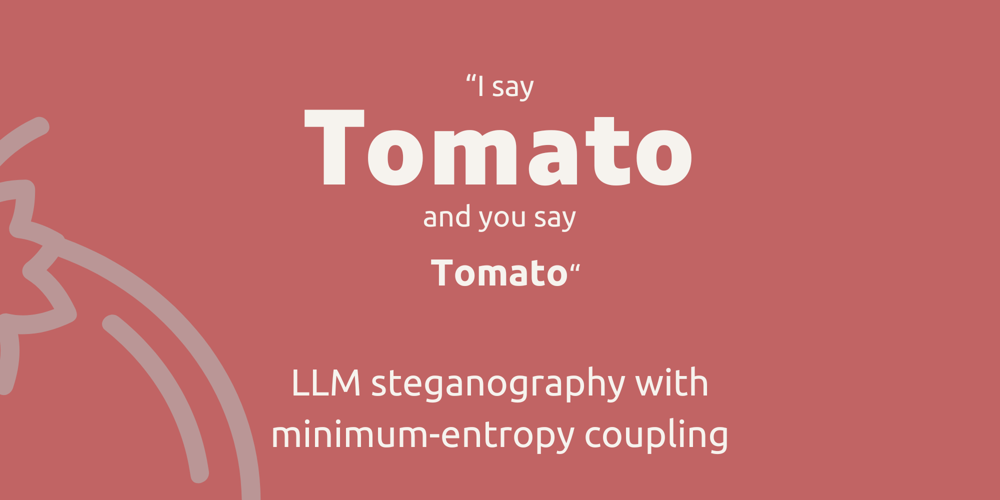

<p align="center">
    
  </a>
</p>
<p align="center"> 🤖 LLM steganography with minimum-entropy coupling 🍅 </p>

**Tomato is a proof of concept steganography tool that utilises minimum-entropy coupling code provided by [ssokota](https://github.com/ssokota/mec/tree/master)! ⭐**

# 🧠 How It Works
- **LLM-Generated Cover Text:** The LLM, as normal, generates coherent text based off a prompt.
- **Embedding with MEC:** MEC is applied to merge the probability distribution of the hidden message (ciphertext) with the distribution of the LLM-generated covertext. This coupling minimizes the joint entropy, ensuring that the stegotext (covertext with the embedded message) retains the statistical properties of natural language, making the hidden message effectively undetectable.
- **Decoding Process:** During decoding, the LLM assists by providing a context-aware interpretation of the stegotext. MEC is then used in reverse to decouple the hidden message from the covertext. The process leverages the same probability distributions used during embedding, ensuring that the message is accurately extracted without compromising the integrity of the covertext.

This method ensures that the hidden message is seamlessly integrated into the text and can be securely and precisely retrieved later, with minimal risk of detection.

# ⚙️ Setup
Tomato required Nvidia CUDA. Follow the steps below:
- Ensure your Nvidia drivers are up to date: https://www.nvidia.com/en-us/geforce/drivers/
- Install the appropriate dependancies from here: https://pytorch.org/get-started/locally/
- Validate CUDA is installed correctly by running the following and being returned a prompt ```python -c "import torch; print(torch.rand(2,3).cuda())"```
  
Install the dependencies using:

```bash
pip install git+https://github.com/user1342/mec
```
```bash
git clone https://github.com/user1342/Tomato.git
cd tomato
pip install -r requirements.txt
pip install -e .
```

# 🏃 Running
You can use the Tomato Encoder/Decoder Tool directly from the command line. Here are the available commands:

## Encode a Message
To encode a plaintext message into stegotext:

```bash
tomato-encode.exe "Your secret message here" --cipher_len 20 --shared_private_key 123abc... --prompt "Good evening."
```

Example:
```bash
tomato-encode.exe "Your plaintext here" --cipher_len 15 --shared_private_key 123abc... --max_len 100 --temperature 1.0 --k 50 --model_name "unsloth/mistral-7b-instruct-v0.3-bnb-4bit"
```

This will output something like:
```
Stegotext: [Your encoded message here]
```

## Decode a Message
To decode a stegotext back into its original plaintext:

```bash
tomato-decode.exe "Your stegotext here" --cipher_len 20 --shared_private_key 123abc... --prompt "Good evening."
```

Example:
```bash
tomato-decode.exe "Your stegotext here" --cipher_len 15 --shared_private_key 123abc... --max_len 100 --temperature 1.0 --k 50 --model_name "unsloth/mistral-7b-instruct-v0.3-bnb-4bit"
```

This will output something like:

```
Estimated Plaintext: [Your decoded plaintext]
Estimated Bytetext: [Your decoded bytetext]
```

## Programatic Example
Checkout the [example playbook](https://github.com/user1342/Tomato/blob/main/example.ipynb)! For a quick demonstration, you can try encoding and decoding a simple message using the following code snippet:

```python
from tomato import Encoder

encoder = Encoder()

plaintext = "I am a hidden code"
formatted_stegotext, stegotext = encoder.encode(plaintext)
estimated_plaintext, estimated_bytetext = encoder.decode(stegotext)

print(formatted_stegotext)
print("------")
print(estimated_plaintext)
```

# 🛡️ Customization Options
The Tomato Encoder/Decoder Tool offers several customizable parameters:

* cipher_len: Length of the cipher (default is 15).
* shared_private_key: Shared private key in hex format. If not provided, a random key will be generated.
* prompt: Prompt for the language model (default is "Good evening.").
* max_len: Maximum length of the covertext (default is 100).
* temperature: Sampling temperature for the language model (default is 1.0).
* k: The k parameter for the language model (default is 50).
* model_name: Name of the language model to be used (default is "unsloth/mistral-7b-instruct-v0.3-bnb-4bit").

# 🙏 Contributions
Tomato is an open-source project and welcomes contributions from the community. If you would like to contribute to Tomoto, please follow these guidelines:

- Fork the repository to your own GitHub account.
- Create a new branch with a descriptive name for your contribution.
- Make your changes and test them thoroughly.
- Submit a pull request to the main repository, including a detailed description of your changes and any relevant documentation.
- Wait for feedback from the maintainers and address any comments or suggestions (if any).
- Once your changes have been reviewed and approved, they will be merged into the main repository.

# ⚖️ Code of Conduct
Tomato follows the Contributor Covenant Code of Conduct. Please make sure to review and adhere to this code of conduct when contributing to Tomato.

# 🐛 Bug Reports and Feature Requests
If you encounter a bug or have a suggestion for a new feature, please open an issue in the GitHub repository. Please provide as much detail as possible, including steps to reproduce the issue or a clear description of the proposed feature. Your feedback is valuable and will help improve Monocle for everyone.

# 📜 License
MIT
